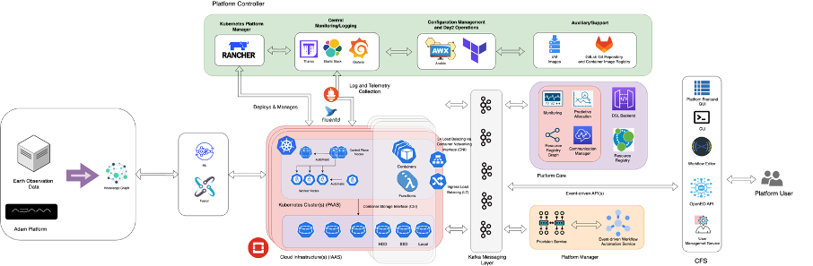

# EO4EU Tutorial IGARSS 2024

## EO4EU Objectives

AI-augmented ecosystem for Earth Observation data accessibility with Extended reality User Interfaces for Service and data exploitation, or EO4EU, is a European Commission funded innovation project which aims at creating an advanced platform for searching, discovering, processing and analyzing EO data.​
​
The platform leverages machine learning to support handling of the characteristically-large volume of EO data as well as a combination of cloud computing infrastructure and pre-exascale high-performance computing to manage processing workloads.​

The EO4EU Platform allows for searching, discovering processing and analyzing EO data and is based on a series of innovative technologies which allow to:​

- Access EO data from different sources (e.g., Copernicus, Galileo, ECMWF)​.
- Support a sophisticated representation of data through a semantic-enhanced Knowledge Graph​.
- Use Machine Learning from marketplace to EO data processing​.
- Visualize EO data through easy-to-use graphical interfaces and Extended Reality applications​.

## EO4EU Architecture



## EO4EU Infrastructure


Check out the content pages bundled with this sample book to see more.

## EO4EU Use Cases

- *EO for Personalized Health Care*: to expand mobile allergy and airbrone hazards forecasting
- *Food Security*: to improve the adaptability of food production using EO4EU fpr live climate data tracking and analysis.
- *Soil Erosion*: to integrate rainfall datasets through EO4EU to assess soil suspectibility to water erosion.
- *Civil Protection*: to improve disaster and calamity prevention and response using EO datasets.
- *Ocean Monitoring*: to optimize shipping industry travel time across different oceans considering live weather data.
- *Forest Ecosystem*: to improve forest productivity using EO4EU to simulate water, energy and carbon fluxes.
- *Environmental Pests*: to assess and predict the impact of locust plague.

> For more information visit [EO4EU website](https://eo4eu.eu)

```{tableofcontents}
```
